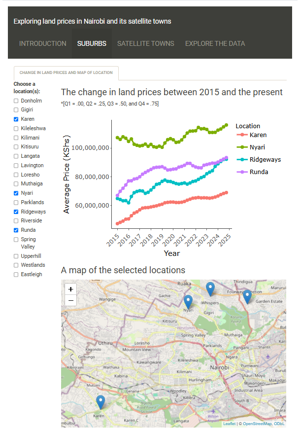
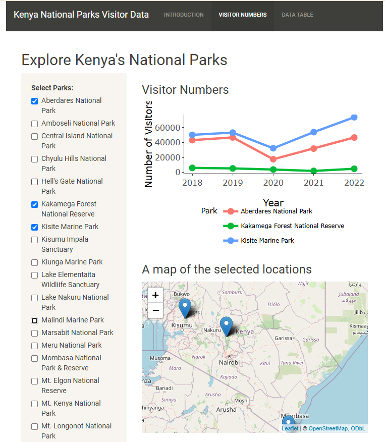

# Shiny App Development

This repo contains code and links for Shiny Apps that I have developed.

[My personal domain project website](https://www.williamokech.com/portfolio/projects)

[My netlify project website](https://williamokech.netlify.app/portfolio/projects)

## App 1: Nairobi Land Prices

The purpose of this Shiny App is to present land price information for Nairobi and its satellite towns. The data is provided by HassConsult Limited through the HassConsult Land Index (quarterly publication).

## App 2: Kenya National Parks Visitor Data

This app was developed to provide insights into the visitor number data (for Kenyan National Parks) over a specified period of time. The data source is the Kenya Parks Investments Prospectus (2023).

